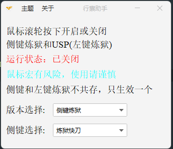
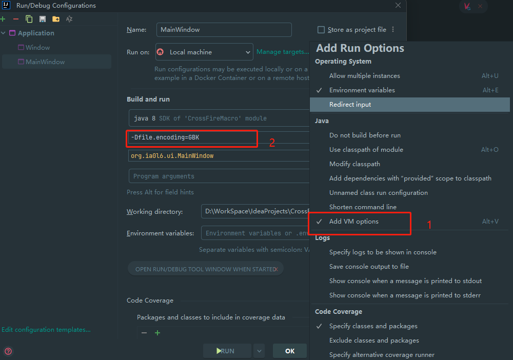

# CF炼狱鼠标宏助手

# 使用方法：
## 1.下载或克隆项目代码
## 2.使用IDEA打开项目
## 3.运行项目-MainWindow
## 4.点击鼠标滚轮按键会看到运行开关效果
## 5.进入游戏实战模式，可选侧键/左键

# 项目结构
## 1.主程序：MainWindow.java

# 如何打包成exe可执行文件
## 1.下载exe4j打包
## 2.下载launch4j打包

# 项目说明
## 该项目旨在学习鼠标宏的基本原理

# 乱码说明
## 确保运行的MainWindow Edit Configuration -VM Options中添加-Dfile.encoding=GBK

